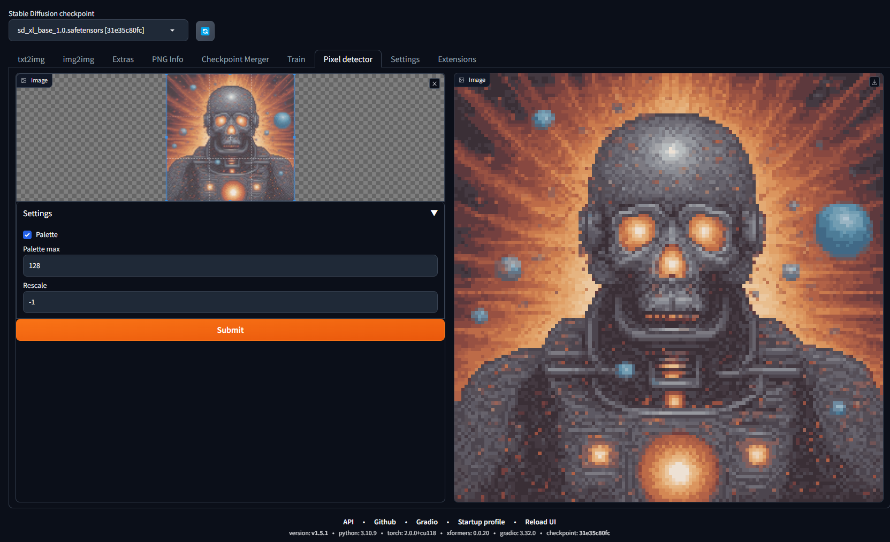

# Pixel Detector

Downscale and restore pixel art images that have been resized or corrupted.

This is primarily created to fix compression issues from saving pixel art in jpg format, or from pixel art generated by diffusion AI models.

## Installation

1. Install into webui by going to Extensions → Install from URL, pasting the URL to this GitHub repository, then clicking Install
2. Restart webui by going to Extensions → Installed and pressing Apply and restart UI

## Usage

1. Go to the Pixel Detector tab on the webui
2. Upload image by drag and dropping, uploading from your machine, or pasting with `Ctrl + V`
3. Adjust [Settings](#settings) to your liking
4. Press Submit and wait for the output to render on the right

## Settings

`Palette`: Automatically reduce the image to a predicted color palette
`Palette max`: Max colors for palette computation, more = slower
`Rescale`: Scaling done to the output. `-1` means scale back to original size, `1` means don't rescale, `n` means scale `n` times.

## Other implementations

- Built into Aseprite with Retro Diffusion pixel art generator: https://astropulse.gumroad.com/l/RetroDiffusion

## Credits

Thanks to @Astropulse and @paultron for the downscaling logic. I just wrapped it as is into a AUTOMATIC1111 sd-webui extension.

Test image by Skeddles https://lospec.com/gallery/skeddles/rock-and-grass
